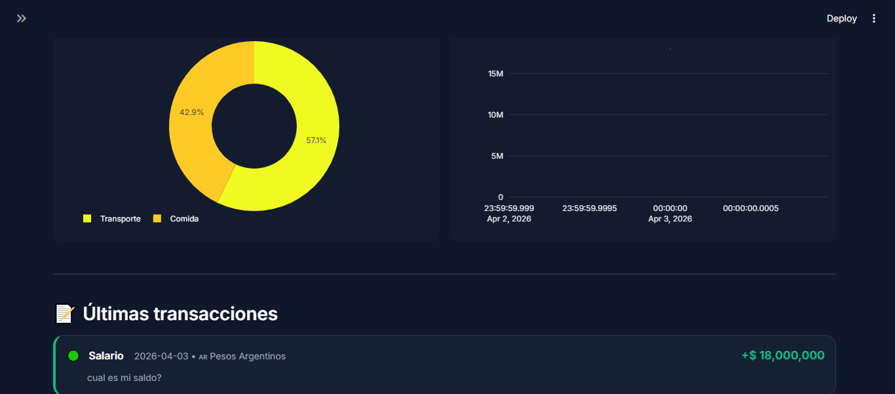
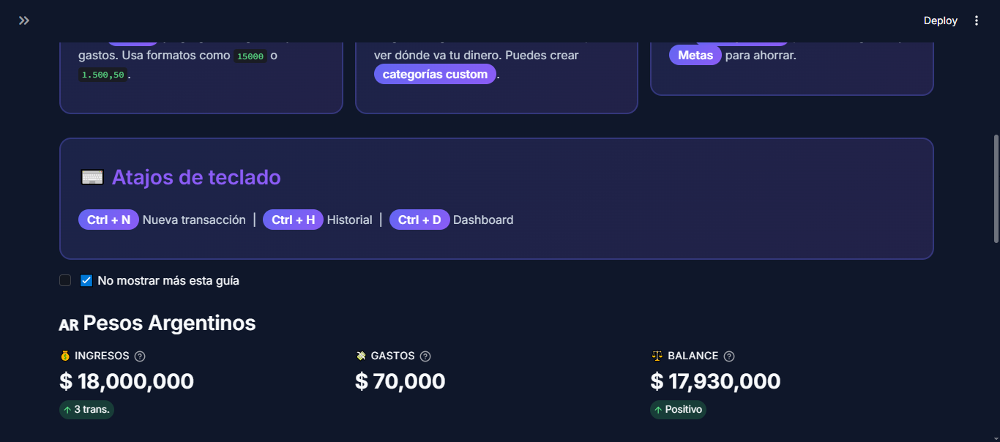
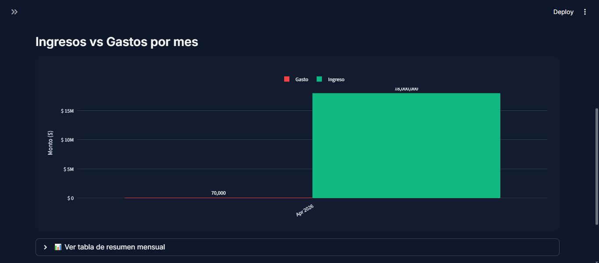
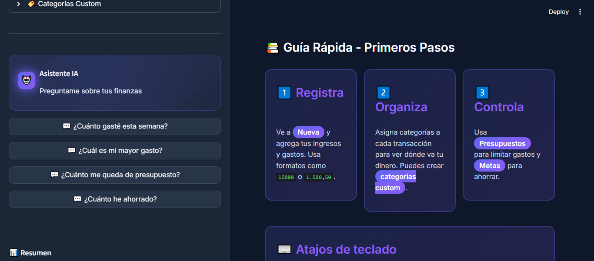
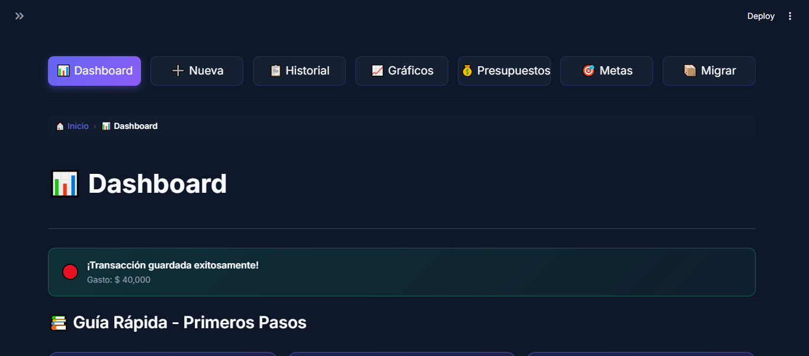
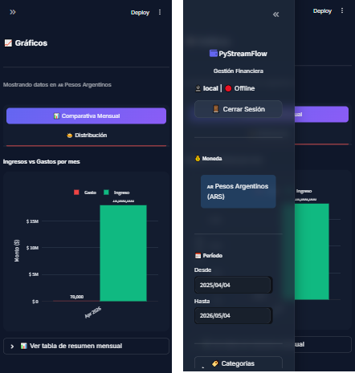

# 💰 PyStreamFlow

<div align="center">


**🚀 Personal finance management web app with integrated AI**

[📱 Demo](#-demo) • [📋 Features](#-features) • [🛠️ Installation](#-installation) • [📖 Technical Docs](#-technical-documentation) • [🤝 Contribute](#-contribute)

</div>

---

## 🌟 Why PyStreamFlow?

| Feature | Description |
|---------|-------------|
| 🎯 **Smart** | Automatic amount detection (US/EU format) |
| 📊 **Visual** | Interactive charts with Plotly |
| 🤖 **AI** | Financial assistant with HuggingFace + local fallback |
| 💾 **Persistent** | Local SQLite, no setup required |
| 📱 **PWA** | Installable as mobile app |
| 🔒 **Secure** | Optional authentication via Supabase |
| 🧪 **Tested** | 17 unit tests passing |

---

## 📱 Demo

🔗 **[Live App](https://pystreamflow-ai-ufg7wsp8pcxpatqt3lxrsk.streamlit.app/)** ↗️

---

## 📸 Screenshots

<div align="center">

| Desktop - Dashboard | Desktop - New Transaction | Desktop - History |
|---------------------|-------------------------|-------------------|
|  |  |  |

| Desktop - Charts | Desktop - Budgets | Mobile |
|--------------------|----------------------|-------|
|  |  |  |

</div>

---

```
┌─────────────────────────────────────────────────────────────┐
│  💰 PyStreamFlow                              [Dashboard]   │
├─────────────────────────────────────────────────────────────┤
│                                                             │
│   ┌──────────────┐  ┌──────────────┐  ┌──────────────┐    │
│   │   INGRESOS   │  │    GASTOS    │  │   BALANCE    │    │
│   │  $ 150,000   │  │   $ 45,000   │  │  $ 105,000   │    │
│   └──────────────┘  └──────────────┘  └──────────────┘    │
│                                                             │
│   📈 Evolución de Gastos    |    🍰 Por Categoría         │
│   ┌──────────────────┐      |    ┌──────────────────┐     │
│   │  ▓▓▓▓▓▓░░░░░░    │      │    │   ████░░░░░░    │     │
│   │  ▓▓▓▓▓▓▓▓░░░░    │      │    │   ██████░░░░    │     │
│   └──────────────────┘      |    └──────────────────┘     │
│                                                             │
│   📝 Transacciones Recientes                              │
│   ┌─────────────────────────────────────────────────────┐│
│   │ 🟢 Salario        $ 80,000    15/03/2024            ││
│   │ 🔴 Supermercado   $ 15,000    14/03/2024            ││
│   │ 🔴 Transporte     $ 5,000     14/03/2024            ││
│   └─────────────────────────────────────────────────────┘│
│                                                             │
└─────────────────────────────────────────────────────────────┘
```

---

## ✨ Features

### 🏠 Core
- ✅ Transaction recording with **smart amount detection**
- ✅ **Dashboard** with real-time metrics
- ✅ **Currency: Argentine Pesos (ARS)**
- ✅ Date filters with validation
- ✅ Interactive Plotly charts with tooltips
- ✅ Pagination in history (1000+ transactions)

### 💰 Financial Management
- ✅ **Monthly budgets** per category with visual alerts
- ✅ **Savings goals** with visual progress
- ✅ In-app alerts when budget exceeded
- ✅ Complete history with search, filters, editing

### 💾 Data & Sync
- ✅ Local **SQLite** persistence
- ✅ Backup/Import **JSON**
- ✅ **PDF** report export
- ✅ **Supabase** authentication (optional)
- ✅ Offline mode without account

### 🏷️ Categories
- ✅ Predefined: Food, Housing, Transport, etc.
- ✅ **Custom**: Create your own categories

### 🤖 AI Assistant
- ✅ Floating chat with personalized responses
- ✅ **HuggingFace Zephyr** for intelligent analysis
- ✅ **Local fallback** without internet

### 🎨 UI/UX
- ✅ **Responsive** design (mobile + desktop)
- ✅ **Animations** micro-interactions
- ✅ **Onboarding** tutorial
- ✅ Skeleton loaders
- ✅ **PWA** installable as app

### ⌨️ Keyboard Shortcuts
| Shortcut | Action |
|----------|--------|
| `Ctrl + N` | New transaction |
| `Ctrl + H` | Go to History |
| `Ctrl + D` | Go to Dashboard |

---

## 🛠️ Installation

### Requirements
- Python 3.10+
- pip

### Step by step

```bash
# 1. Clone repository
git clone https://github.com/your-user/pystreamflow.git
cd pystreamflow

# 2. Create virtual environment
python -m venv venv

# Windows
venv\Scripts\activate

# macOS/Linux
source venv/bin/activate

# 3. Install dependencies
pip install -r requirements.txt

# 4. Configure environment variables (optional)
cp .env.example .env

# 5. Run
streamlit run pystreamflow.py
```

### 🚀 Deploy on Streamlit Cloud

```bash
# 1. Push to GitHub
# 2. Go to https://streamlit.io/cloud
# 3. Connect GitHub → Select repo
# 4. Main file: pystreamflow.py
# 5. Enjoy! 🌐
```

---

## 🏗️ Technical Architecture

```
pystreamflow/
├── pystreamflow.py       # ⭐ Main app (3134 lines)
├── database.py           # 📦 SQLite data layer (479 lines)
├── auth.py               # 🔐 Supabase auth (181 lines)
├── style.css             # 🎨 Styles (1540 lines)
├── test_app.py           # 🧪 Unit tests (213 lines)
├── requirements.txt      # 📋 Dependencies
├── pyproject.toml        # ⚙️ Python config
├── .env.example          # 🔧 Config template
├── LICENSE               # 📜 MIT License
├── README.md             # 📖 This file
├── run.bat / run.sh      # ⚡ Run scripts
├── static/
│   ├── manifest.json     # 📱 PWA manifest
│   └── service-worker.js # 🌐 PWA service worker
└── venv/                 # 🐍 Virtual environment (not versioned)
```

---

## 📖 Technical Documentation

### Tech Stack

| Layer | Technology | Version |
|-------|------------|---------|
| **Framework** | Streamlit | ≥1.30.0 |
| **Data** | Pandas | ≥2.0.0 |
| **Visualization** | Plotly | ≥5.18.0 |
| **PDF** | ReportLab | ≥4.0.0 |
| **Database** | SQLite | built-in |
| **AI Cloud** | HuggingFace Hub | ≥0.20.0 |
| **Auth Cloud** | Supabase | ≥2.0.0 |
| **Testing** | Pytest | ≥8.0.0 |

### Database Schema

```sql
-- Transactions
CREATE TABLE transacciones (
    id TEXT PRIMARY KEY,
    tipo TEXT NOT NULL,
    monto REAL NOT NULL,
    categoria TEXT NOT NULL,
    descripcion TEXT,
    fecha TEXT NOT NULL,
    moneda TEXT DEFAULT 'ARS',
    user_id TEXT,
    created_at TEXT
);

-- Budgets
CREATE TABLE presupuestos (
    id INTEGER PRIMARY KEY,
    user_id TEXT,
    categoria TEXT NOT NULL,
    limite REAL NOT NULL
);

-- Savings Goals
CREATE TABLE metas_ahorro (
    id TEXT PRIMARY KEY,
    user_id TEXT,
    nombre TEXT NOT NULL,
    objetivo REAL NOT NULL,
    ahorrado REAL DEFAULT 0,
    fecha_limite TEXT,
    categoria TEXT
);

-- Custom Categories
CREATE TABLE categorias_custom (
    id INTEGER PRIMARY KEY,
    user_id TEXT,
    tipo TEXT NOT NULL,
    nombre TEXT NOT NULL
);
```

### Smart Amount Detection

The app automatically detects formats:
```python
"15000"           → 15000    # Simple
"15000 ARS"       → 15000    # With text
"1.500,50"       → 1500.50  # European
"1500.50"        → 1500.50  # American
```

### AI Assistant API

```python
# Query HuggingFace
response = consultar_ia("How much did I spend on food?", context)

# Local fallback (no internet)
response = consultar_ia_local(question, context)
```

---

## 🧪 Testing

```bash
# Run all tests
pytest test_app.py -v

# Specific tests
pytest test_app.py::test_detectar_moneda_simple -v
```

**Results:** 17 tests passing ✅

| Test | Status |
|------|--------|
| `test_detectar_moneda_simple` | ✅ |
| `test_detectar_moneda_con_texto` | ✅ |
| `test_detectar_moneda_con_comas` | ✅ |
| `test_detectar_moneda_decimal` | ✅ |
| `test_detectar_moneda_invalida` | ✅ |
| `test_formatear_monto_ars` | ✅ |
| `test_calcular_metricas_*` | ✅ |
| `test_crear_transaccion` | ✅ |
| `test_generar_id_formato` | ✅ |
| `test_ciclo_completo_transaccion` | ✅ |

---

## ⚙️ Configuration

### Environment Variables

| Variable | Description | Required |
|----------|-------------|----------|
| `HF_TOKEN` | HuggingFace token (cloud AI) | ❌ |
| `SUPABASE_URL` | Supabase project URL | ❌ |
| `SUPABASE_KEY` | Supabase API key | ❌ |

### Usage Modes

| Mode | Description | Requires |
|------|-------------|----------|
| **Local** | SQLite + local data | ❌ Nothing |
| **Cloud** | Supabase sync | ✅ Credentials |
| **AI Cloud** | HuggingFace | ✅ HF Token |
| **AI Local** | Basic responses | ❌ Nothing |

---

## 🔮 Roadmap

- [ ] Multi-currency (USD, EUR)
- [ ] Excel export
- [ ] Push notifications
- [ ] Native mobile app (React Native)
- [ ] Bank integration (Open Banking)
- [ ] Investment tracking

---

## 🤝 Contribute

```bash
# 1. Fork
# 2. Create branch
git checkout -b feature/new-feature

# 3. Commit
git commit -am 'Add new feature'

# 4. Push
git push origin feature/new-feature

# 5. Pull Request
```

---

## 📄 License

MIT License - See [LICENSE](LICENSE)

---

## 🙏 Acknowledgments

- [Streamlit](https://streamlit.io/) - Web Framework
- [Plotly](https://plotly.com/) - Visualization
- [HuggingFace](https://huggingface.co/) - AI Models
- [Supabase](https://supabase.com/) - Backend as a Service
- [ReportLab](https://www.reportlab.com/) - PDFs

---

<div align="center">

⭐ **If you like the project, give it a star!**

Made with ❤️ by PyStreamFlow Team

</div>
